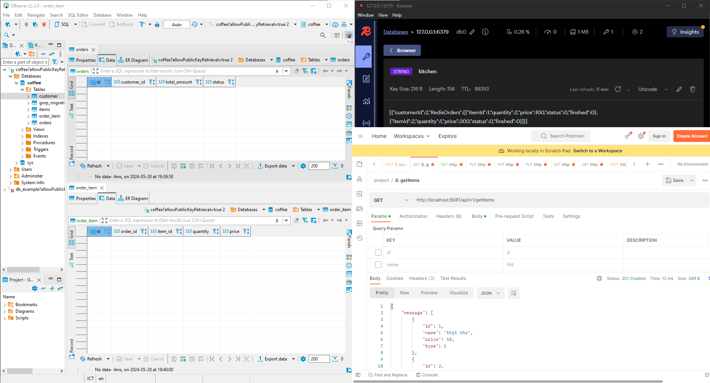
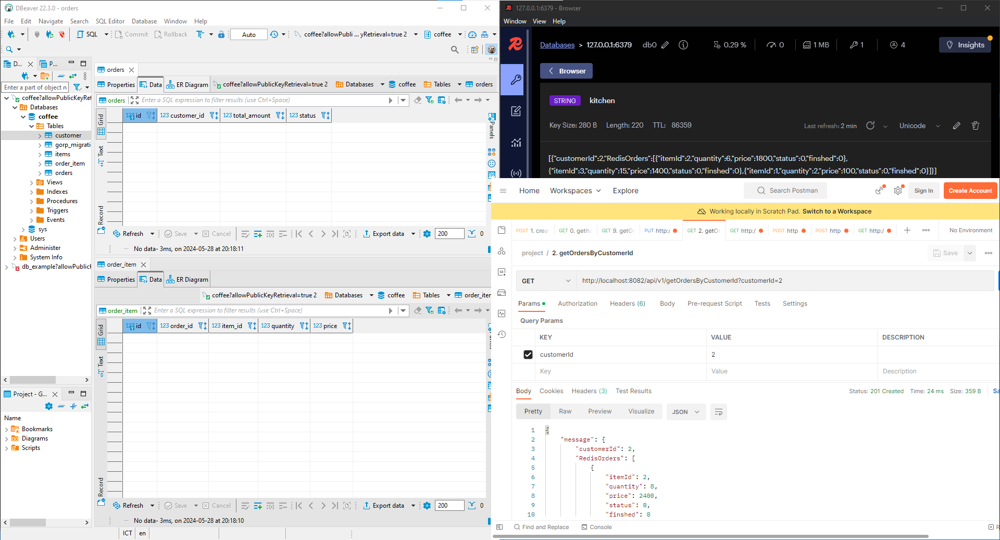
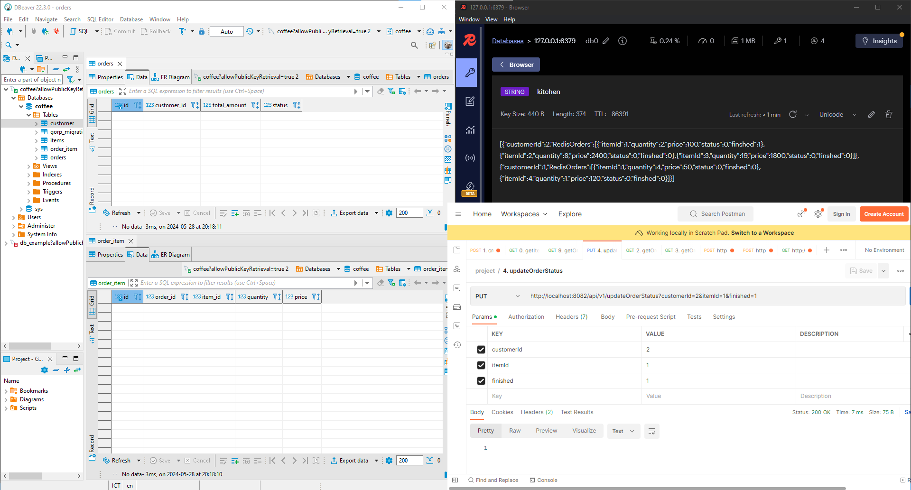
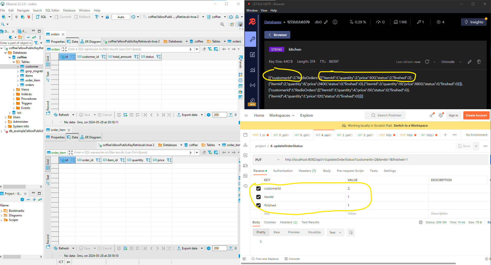
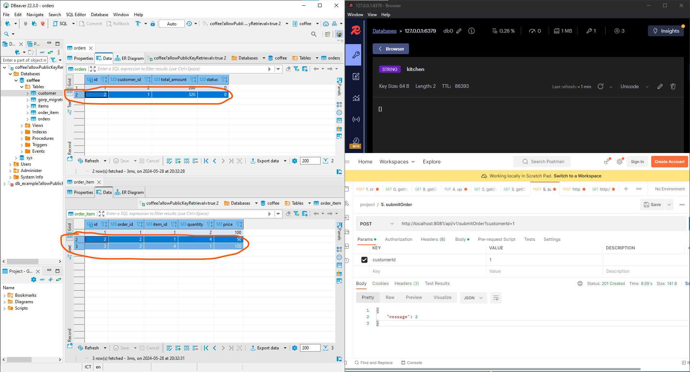
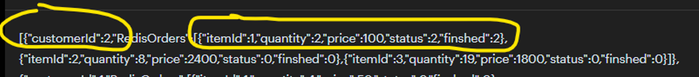
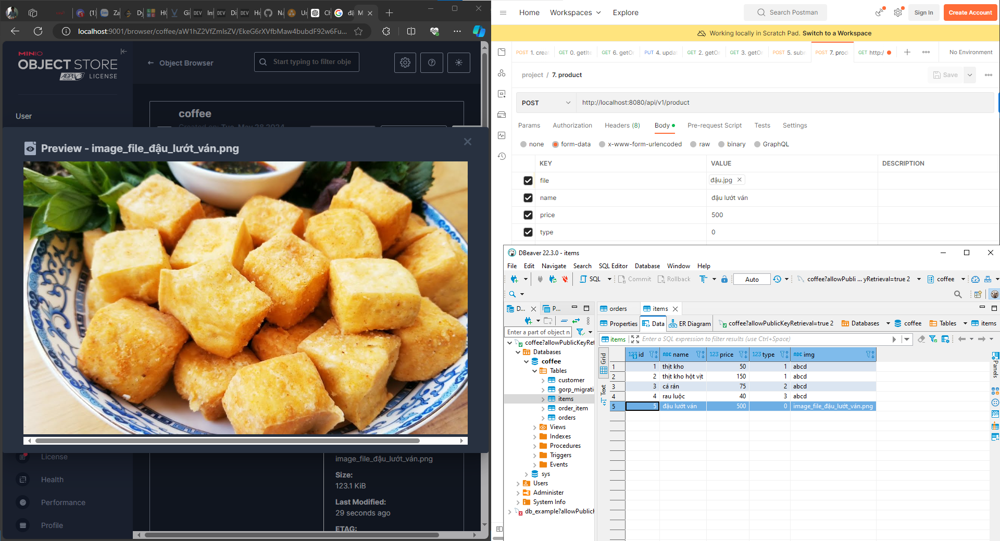
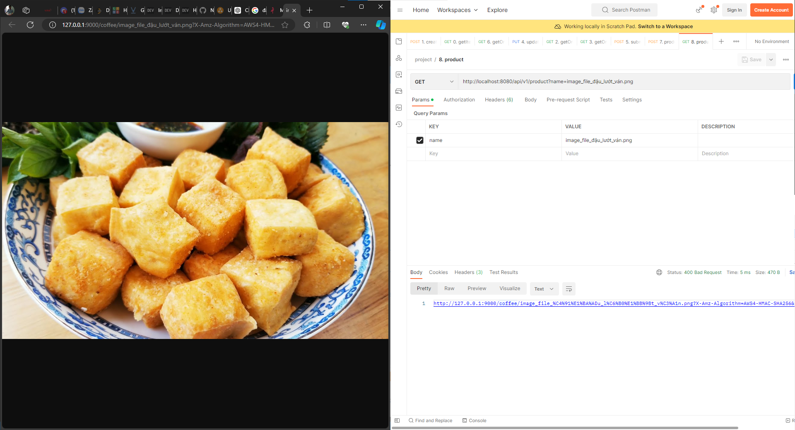

# 1. How to run

        1. `cd deployments/` open cmd: `docker-compose up`
        2. `cd ../`
        3. run counter-service `make run-counter`
        4. run kitchen-service `make run-kitchen`
        5. run product-service `make run-product`

# 2. Technologies

        0. Docker
        1. RESTful - "github.com/gin-gonic/gin"
        2. gRPC - "google.golang.org/grpc"
        3. redis - "github.com/go-redis/redis/v8"
        4. cron job - "github.com/go-co-op/gocron/v2"
        5. kafka - "github.com/IBM/sarama"
        6. minio - "github.com/minio/minio-go"
        7. gorp_migration - "github.com/rubenv/sql-migrate"
        8. goqu - "github.com/doug-martin/goqu/v9"

# 3. Flow


# 4. How's it work

## Please import `coffee-project.postman_collection.json` to your postman and run it

### [Counter] View all items

### [Counter] View item by id or by name

### [Counter] Create new order status == 1 (processing)

### [Kitchen] view order by customerId to cook

### [Kitchen] view all orders

### [Kitchen] update done some items for any customer by customerId

### [Kitchen] if the `finished` == `quantity` => that item of customer's ordert is done (status = 2)

### [Counter] end the order => payment. Only calculate finished item (either is cancel)


In here we only calculate 2 of itemId = 1, cancel 8 of itemId = 2 and 19 of itemId = 3

### [Counter] get completed orders

### [Product] Add new items

### [Product] get image of item


# 5. APIS

## Kitchen
```bash
# get all customerOrder at today
curl --location --request GET 'http://localhost:8082/api/v1/getOrders'

# get customerOrder by customerId
curl --location --request GET 'http://localhost:8082/api/v1/getOrdersByCustomerId?customerId=2'

# update finish order item from kitchen side
curl --location --request PUT 'http://localhost:8082/api/v1/updateOrderStatus?customerId=2&itemId=1&finished=1'

```

## counter
```bash
# search item to order
curl --location --request GET 'http://localhost:8081/api/v1/getItems?id=4&name=thịt' \
--header 'Content-Type: application/json' \
--data-raw '[
    {
        "ItemId": 1,
        "Quantity": 1,
        "Price": 15
    }
]'


# create temporary order
curl --location --request POST 'http://localhost:8081/api/v1/createOrder' \
--header 'Content-Type: application/json' \
--data-raw '{
    "customerId": 2,
    "OrderItems": [
        {
            "ItemId": 1,
            "Quantity": 1,
            "Price": 100
        },
        {
            "ItemId": 2,
            "Quantity": 1,
            "Price": 300
        }
    ]
}'

# getorders by orderId or customerId

curl --location --request GET 'http://localhost:8081/api/v1/getOrders?orderId=1&customerId=2'

# payment done for customer (save to DB)
curl --location --request POST 'http://localhost:8081/api/v1/submitOrder?customerId=2' \
--header 'Content-Type: application/json' \
--data-raw '{
    "customerId": 2,
    "OrderItems": [
        {
            "ItemId": 1,
            "Quantity": 1,
            "Price": 100
        },
        {
            "ItemId": 2,
            "Quantity": 1,
            "Price": 300
        }
    ]
}'
```

## Product 

```bash
# add new item
curl --location --request POST 'http://localhost:8080/api/v1/product' \
--form 'file=@"/C:/Users/vanna/Downloads/3_networking24.png"' \
--form 'name="nem rán"' \
--form 'price="500"' \
--form 'type="0"'

# get image

curl --location --request GET 'http://localhost:8080/api/v1/product?name=image_file_nem_rán.png'
```


# 6. Migration sql

1. Create sql file
2. Run UP to call up migration

```go
migrator := NewMigrator(db)
err = migrator.Up(context.Background())
fmt.Println("Migration up")
if err != nil {
    fmt.Println("failed to execute database up migration")
}
```
3. Result

gorp_migrations to save sql file. Check changelog and build if the file is changed (like liquibase in Java spring boot)


